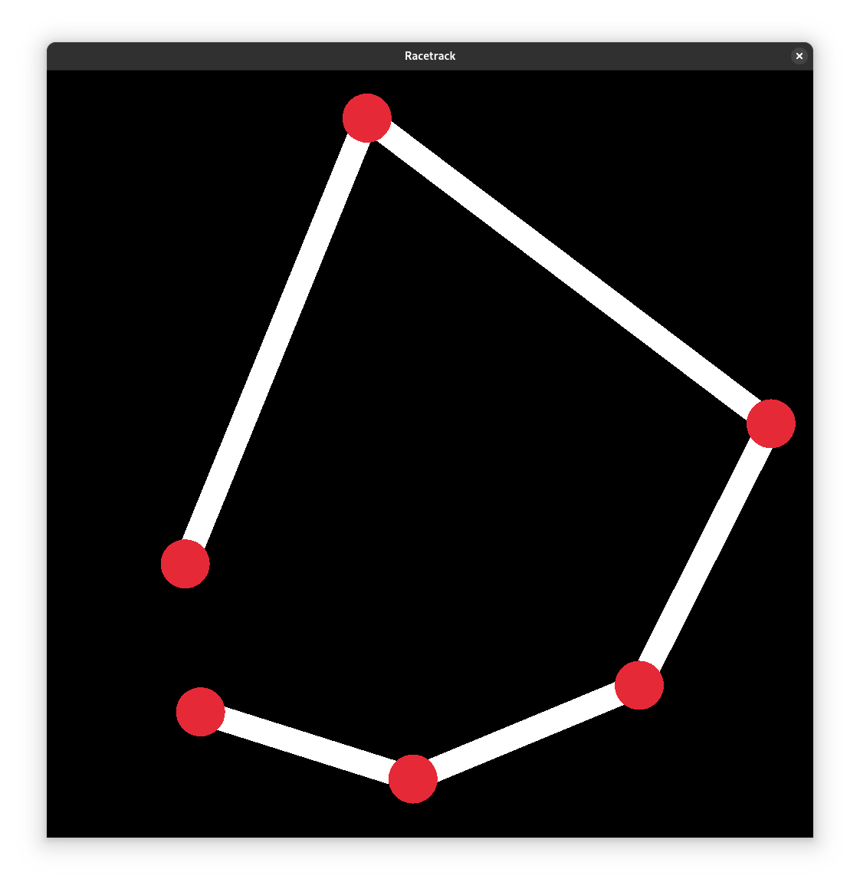
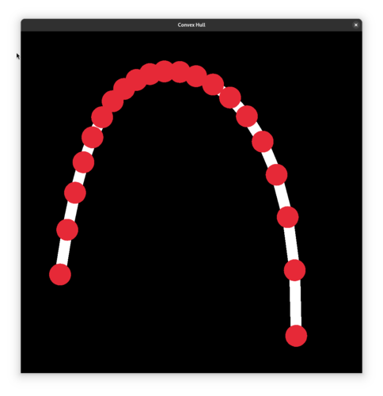

# Convex Hull and Bezier Curves
An implementation of jarvis hull and quick hull for creating a convex hull. And a bezier curve implementation from this python repo [Bezier.py](https://github.com/torresjrjr/Bezier.py) 


## Example Usage

### Convex Hull



Generates a convex hull based on randomly placed points.
```odin
import hull "hullcurve"
import "core:math/rand"

main :: proc() {
  a := make([][2]f32, 10)
  defer delete(a)

  for &p in a {
      x := rand.float32_range(0, 1000)
      y := rand.float32_range(0, 1000)
      p = [2]f32{x, y}
  }
  
  hull_points := hull.jarvishull(a, len(a))
  defer delete(hull_points)
}
```

### Bezier Curve



Generates a curve, in this case using the convex hull to create a curved hull
```odin
import hull "hullcurve"
import "core:math/rand"

main :: proc() {
  a := make([][2]f32, 10)
  defer delete(a)

  for &p in a {
      x := rand.float32_range(0, 1000)
      y := rand.float32_range(0, 1000)
      p = [2]f32{x, y}
  }
  
  hull_points := hull.jarvishull(a, len(a))
  curve_points := hull.bezier_curve(hull_points, 0)
  defer delete(hull_points)
  defer delete(curve_points
}
```
